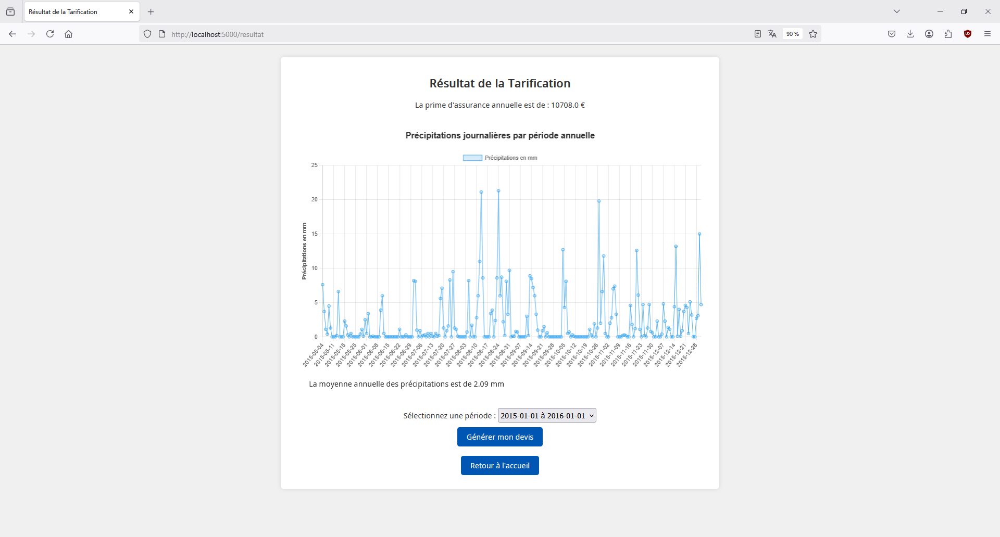
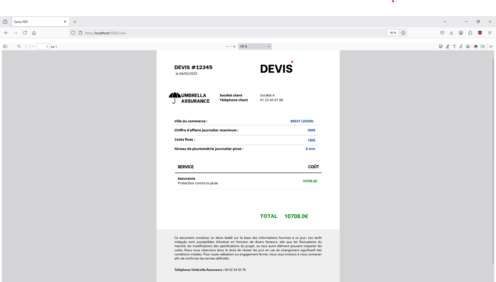
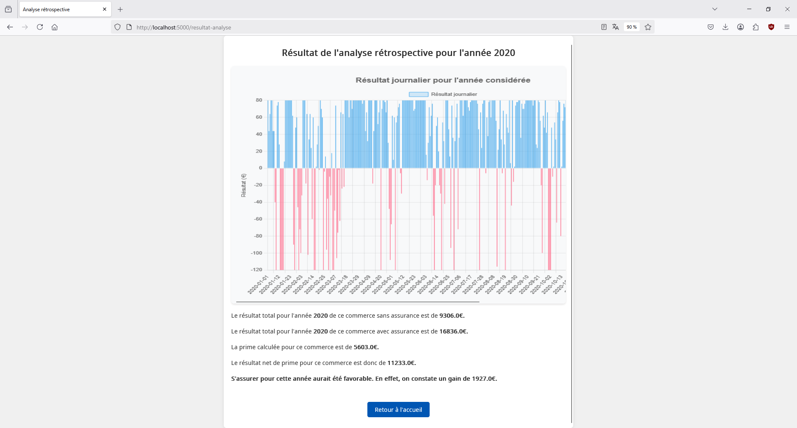

# LOGICIEL D’ASSURANCE DE RISQUE METEOROLOGIQUE 🌦️

Projet développé dans le cadre académique par Mathys J.

Une application web de calcul de devis d'assurance en fonction des données historiques des précipitations et de l'emplacement géographique. 

Développée avec Flask et PostgreSQL, conteneurisée via Docker.


## Prérequis

Avant de commencer, assurez-vous d'avoir installé :
- 🐳 [Docker](https://docs.docker.com/get-docker/) 
- 🐙 [Docker Compose](https://docs.docker.com/compose/install/)

N.B : Sous Windows, l'installation de Docker Desktop entraîne automatiquement l'installation de Docker Compose ✅

## Installation

Le projet est structuré ainsi : 

  projet-meteo/  
  ├── app/  
  │     └── ...  
  ├── fonts/  
  │     └── ...  
  ├── static/  
  │      └── ...  
  ├── templates/  
  │     └── ...  
  ├── .env    
  ├── Dockerfile  
  ├── docker-compose.yml  
  ├── README.md  
  └── requirements.txt  
<br>

Dans un premier temps, clonez le repo :
  ```bash
  git clone https://github.com/polytech-user/projet-meteo.git
  ```

<br>

Dans un terminal, placez vous à la racine du projet :
- Sous Windows :
    ```powershell
    cd C:\chemin\vers\projet-meteo
    ```

- Sous Linux :
    ```bash
    cd chemin/vers/projet-meteo
    ```
<br>
Lancez les conteneurs avec cette commande :

  ```bash
  docker-compose up --build -d
  ```

<br>

## Utilisation

Une fois les conteneurs lancés, rendez vous sur votre navigateur et entrez l'adresse suivante :
  ```url
  localhost:5000
  ```

<br>

Vous devriez arriver sur cette interface :<br><br>


<br>
Pour stopper l'application proprement, placez vous à la racine du projet et exécutez la commande suivante :  

  ```bash
  docker-compose down -v --remove-orphans
  ```

## Fonctionnalités
### 📊 Calcul de devis d'assurance en fonction des précipitations historiques

L'utilisateur renseigne sa ville et le chiffre d'affaires journalier de son commerce ainsi que le niveau de pluviométrie auquel il souhaite être assuré. L'application calcule le montant de l'assurance en fonction des données historiques de précipitations pour cette ville.

<br>


<em>Formulaire de calcul d'un devis basé sur les données météorologiques locales</em>


<br>



<em>Résultat de la tarification</em>

<br>



<em>Génération du devis personnalisé au format PDF</em>


### 🔍 Analyse rétrospective des précipitations

L'utilisateur peut consulter une analyse complète d'une année passée pour une ville donnée. L'application affiche les résultats journaliers pour l'année sélectionnée en fonction des données historiques de précipitations. Le résultat annuel avec et sans assurance du commerce est calculé indiquant si l'assurance aurait été bénéfique ou non.

<br>

<br>
<em>Visualisation des résultats journaliers du commerce en fonction des précipitations pour l'année considérée</em>


