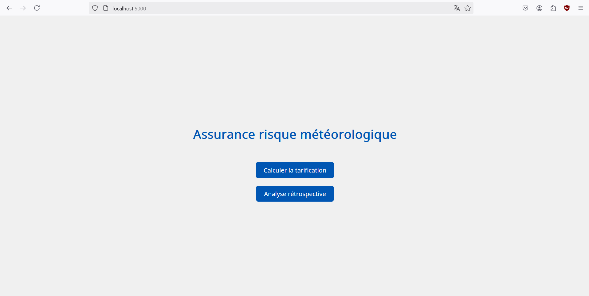

# LOGICIEL D’ASSURANCE DE RISQUE METEOROLOGIQUE 🌦️

Une application web de calcul de devis d'assurance en fonction des données historiques des précipitations et de l'emplacement géographique. 

Développée avec Flask et PostgreSQL, conteneurisée via Docker.


## Prérequis

Avant de commencer, assurez-vous d'avoir installé :
- 🐳 [Docker](https://docs.docker.com/get-docker/) 
- 🐙 [Docker Compose](https://docs.docker.com/compose/install/)

N.B : Sous Windows, l'installation de Docker Desktop entraîne automatiquement l'installation de Docker Compose ✅

## Installation

Le projet est structuré ainsi : 

  projet-meteo/  
  ├── app/  
  │     └── ...  
  ├── fonts/  
  │     └── ...  
  ├── static/  
  │      └── ...  
  ├── templates/  
  │     └── ...  
  ├── .env    
  ├── Dockerfile  
  ├── docker-compose.yml  
  ├── README.md  
  └── requirements.txt  
<br>

Dans un premier temps, clonez le repo :
  ```bash
  git clone https://github.com/polytech-user/projet-meteo.git


Dans un terminal, placez vous à la racine du projet :
- Sous Windows :
    ```powershell
    cd C:\chemin\vers\projet-meteo
    ```

- Sous Linux :
    ```bash
    cd chemin/vers/projet-meteo
    ```
<br>
Lancez les conteneurs avec cette commande :

  ```bash
  docker-compose up --build -d
  ```

<br>

## Utilisation

Une fois les conteneurs lancés, rendez vous sur votre navigateur et entrez l'adresse suivante :
  ```url
  localhost:5000
  ```

<br>

Vous devriez arriver sur cette interface :<br><br>



<br>
Pour stopper l'application proprement, placez vous à la racine du projet et exécutez la commande suivante :  

  ```bash
  docker-compose down -v --remove-orphans
  ```


